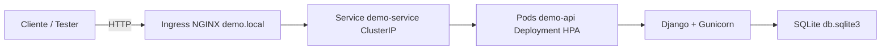
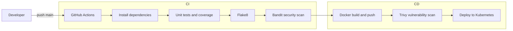

# Demo DevOps Python – Django + DRF

Aplicación sencilla de gestión de usuarios, usada como base para una prueba técnica de DevOps.  
Incluye:

- API REST en Django REST Framework.
- Contenedor Docker preparado para producción con Gunicorn.
- Manifiestos de Kubernetes (Deployment, Service, Ingress, HPA, ConfigMap, Secret).
- Pipeline CI/CD en GitHub Actions (tests, análisis estático, coverage, build & push de imagen, escaneo de vulnerabilidades, deploy a K8s).
- Infraestructura como código (Terraform) para un repositorio ECR en AWS.

---

## 1. Arquitectura de la solución

### 1.1 Vista lógica



---

## 2. API y funcionalidades

La API expone un recurso `User` con los campos:

- `id` (autogenerado)
- `dni` (string, único, longitud máx. 13)
- `name` (string, longitud máx. 30)

### 2.1 Endpoints principales

Base URL local por defecto: `http://localhost:8000/`

- Healthcheck:
  - `GET /health/`
  - Respuesta 200:
    ```json
    { "status": "ok" }
    ```

- Listar usuarios:
  - `GET /api/users/`
  - Respuesta 200:
    ```json
    [
      {
        "id": 1,
        "dni": "dni",
        "name": "name"
      }
    ]
    ```

- Obtener un usuario por id:
  - `GET /api/users/<id>/`
  - Respuesta 200:
    ```json
    {
      "id": 1,
      "dni": "dni",
      "name": "name"
    }
    ```
  - Si el usuario no existe:
    ```json
    {
      "detail": "Not found."
    }
    ```

- Crear usuario:
  - `POST /api/users/`
  - Cuerpo:
    ```json
    {
      "dni": "dni",
      "name": "name"
    }
    ```
  - Respuesta 201:
    ```json
    {
      "id": 1,
      "dni": "dni",
      "name": "name"
    }
    ```
  - Si ya existe un usuario con el mismo `dni`:
    ```json
    {
      "detail": "User already exists"
    }
    ```

---

## 3. Pipeline CI/CD

El pipeline está definido en `.github/workflows/ci-cd.yml` y se ejecuta en cada `push` o `pull_request` a la rama `main`.



### 3.1 Jobs

- `build_and_test`
  - Instala dependencias desde `requirements-dev.txt`.
  - Ejecuta:
    - `flake8` (estilo de código).
    - `bandit` (análisis estático de seguridad).
    - `coverage run manage.py test` + `coverage xml`.

- `docker_build_and_push`
  - Inicia sesión en Docker Hub con `DOCKERHUB_USERNAME` y `DOCKERHUB_TOKEN`.
  - Construye y publica la imagen:
    - `jdman2001/devsu-test-devops:<sha>`
    - `jdman2001/devsu-test-devops:latest`

- `vulnerability_scan`
  - Ejecuta Trivy sobre la imagen `jdman2001/devsu-test-devops:latest` con severidad `CRITICAL,HIGH`.

- `deploy_to_k8s`
  - Crea un cluster local con kind.
  - Aplica todos los manifiestos de `k8s/`.
  - Actualiza la imagen del `Deployment` al commit actual.
  - Comprueba el estado del rollout.

---

## 4. Ejecución local (sin Docker)

### 4.1 Prerrequisitos

- Python 3.12
- `pip`
- Opcional: `virtualenv`

### 4.2 Instalación

Clonar el repositorio (sustituir la URL por la de este repo):

```bash
git clone <url-de-este-repositorio>.git
cd <nombre-del-repositorio>
```

Crear y activar un entorno virtual:

```bash
python -m venv venv
source venv/bin/activate      # En Windows: venv\Scriptsctivate
```

Instalar dependencias de desarrollo:

```bash
pip install --upgrade pip
pip install -r requirements-dev.txt
```

Crear archivo `.env` en la raíz con el siguiente contenido de ejemplo:

```text
DJANGO_SECRET_KEY=change-me
DJANGO_DEBUG=True
DJANGO_ALLOWED_HOSTS=localhost,127.0.0.1
DATABASE_NAME=db.sqlite3
```

Aplicar migraciones:

```bash
python manage.py migrate
```

### 4.3 Ejecutar la aplicación

```bash
python manage.py runserver 0.0.0.0:8000
```

La base de datos se crea como un archivo `db.sqlite3` en la raíz del proyecto.

### 4.4 Ejecutar tests y coverage

```bash
coverage run manage.py test
coverage report
```

---

## 5. Ejecución con Docker

La imagen se basa en `python:3.12-slim` y usa Gunicorn para servir el proyecto en el puerto 8000.

### 5.1 Build

```bash
docker build -t devsu-test-devops:local .
```

### 5.2 Run

```bash
docker run --rm -p 8000:8000   -e DJANGO_SECRET_KEY="change-me"   -e DJANGO_DEBUG=False   -e DJANGO_ALLOWED_HOSTS="localhost,127.0.0.1"   -e DATABASE_NAME="db.sqlite3"   devsu-test-devops:local
```

Endpoints:

- `http://localhost:8000/health/`
- `http://localhost:8000/api/users/`

---

## 6. Despliegue en Kubernetes

Los manifiestos de Kubernetes se encuentran en la carpeta `k8s/`:

- `namespace.yaml` – Namespace `devsu-demo`.
- `configmap.yaml` – Variables de configuración (`DJANGO_DEBUG`, `DJANGO_ALLOWED_HOSTS`, `DATABASE_NAME`).
- `secret.yaml` – `DJANGO_SECRET_KEY`.
- `deployment.yaml` – Deployment `demo-deployment` con:
  - 2 réplicas iniciales.
  - Requests/limits de CPU y memoria.
  - Probes de liveness y readiness contra `/health/`.
  - Contenedor `jdman2001/devsu-test-devops:latest`.
- `service.yaml` – Service `demo-service` tipo `ClusterIP`.
- `ingress.yaml` – Ingress `demo-ingress` para el host `demo.local`.
- `hpa.yaml` – HorizontalPodAutoscaler `demo-hpa` (de 2 a 5 pods según uso de CPU).

### 6.1 Requisitos

- `kubectl` configurado.
- Kubernetes local (Docker Desktop, Minikube o kind).

### 6.2 Aplicar manifiestos

```bash
kubectl apply -f k8s/namespace.yaml
kubectl apply -f k8s/
kubectl get pods -n devsu-demo
kubectl get hpa -n devsu-demo
kubectl get ingress -n devsu-demo
```

Añadir entrada en `/etc/hosts` (o equivalente en Windows):

```text
127.0.0.1 demo.local
```

Acceso:

- `http://demo.local/health/`
- `http://demo.local/api/users/`

---

## 7. Infraestructura como código (IaC) – AWS ECR

Para obtener puntos extra de IaC se incluye un módulo de Terraform en `infra/aws-ecr` que crea un repositorio ECR en AWS para almacenar la imagen Docker de la aplicación.

Estructura:

- `infra/aws-ecr/main.tf`
- `infra/aws-ecr/variables.tf`
- `infra/aws-ecr/README.md`

### 7.1 Uso básico

```bash
cd infra/aws-ecr
terraform init
terraform apply
```

La salida mostrará la URL del repositorio ECR en el campo `ecr_repository_url`, que puede utilizarse como destino de las imágenes del pipeline.

---

## 8. Estructura principal del proyecto

```text
.
├── api/                # App Django REST (modelos, vistas, serializers, tests)
├── demo/               # Configuración del proyecto Django (settings, urls, wsgi, asgi)
├── k8s/                # Manifiestos de Kubernetes
├── infra/
│   └── aws-ecr/        # Módulo Terraform para ECR en AWS
├── .github/workflows/  # Pipeline CI/CD de GitHub Actions
├── Dockerfile          # Imagen Docker para producción
├── requirements.txt    # Dependencias de runtime
├── requirements-dev.txt# Dependencias de desarrollo
├── manage.py           # Entrypoint de Django
└── README.md
```

---

## 9. Licencia

Copyright © 2023 Devsu. All rights reserved.
